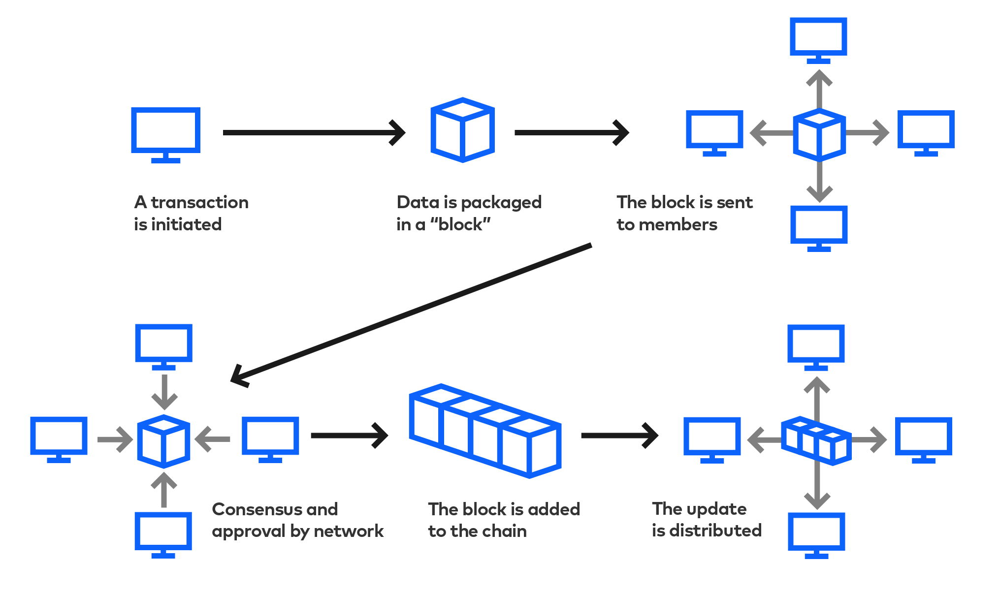

# < Exercise Title >
< Exercise Body >


## 1. Problem
Short description of what we are trying to accomplish.

### Input/s
1.
2.
3.

### Output/s
1.
2.
3.

### Rules/Requirements
#### Explicit
1.
2.
3.

#### Implicit
1.
2.
3.

### Edge Cases
- e.g. of edge case: display number from 1 - *n* (Do we include or exclude *n*?)
- Related topic: test cases handle "Edge Cases"

### Constraints
- What is the max number this program can handle?
- e.g. 1 to Infinity? or 1 - 10 billion?

### Clarify questions
1.
2.
3.


### Problem Domain
e.g. Array iteration, Accounting, factorization, linear algebra, etc.

### Diagram (Optional)
- Helps you understand the problem.



### Mental Model
**Example:**
Determine a list of all multiples of a set of factors up to a target value, then filter the list of multiples to the unique values. Finally, compute and return the sum of the unique multiples.


## 2. Examples/Test Cases
- Validate Understanding of the Problem

e.g. Given an array of numbers, return only the even number
     A: [1, 2, 3, 4, 5, 6] -> [2, 4, 6]


---
## 3. Data Structure
- How we'll represent data that we'll work with when converting the input to output
- e.g. array or object?


---
## 4. Algorithm
- Outline of the steps that will be needed to convert input to output

#### pseudocode
```js
1. Create an empty array called `multiples` that will contain the list of multiples
2. Check whether the list of factors is empty. If there are no factors, set the list to `[3, 5]`
3. For every `factor` in the `factors` list:
    1. Set the `current_multiple` to `factor` to keep track of the multiples of `factor`.
    2. While `current_multiple` < `target`
        1. Is the `current_multiple` in `multiples` already?
            1. Yes - do nothing
            2. No - Append the `current_multiple` to `multiples`.
        2. Add `factor` to `current_multiple`.
4. Compute and return the sum of the numbers in `multiples`.
```

#### Formal pseudocode
```js
START

# Given a collection of integers called "numbers"

SET iterator = 1
SET savedNumber = value within numbers collection at space 1

WHILE iterator <= length of numbers
  SET currentNumber = value within numbers collection at space "iterator"
  IF currentNumber > savedNumber
    savedNumber = currentNumber
  ELSE
    skip to the next iteration

  iterator = iterator + 1

PRINT savedNumber

END
```

#### Flowchart (Optional)
- Shows you the flow of the program.


---
## 5. Code
- Implement the algorithm with code